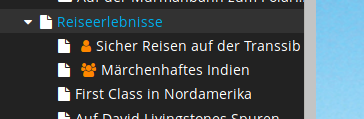

# Sitegeist.TrafficLights

> Visualize concurrent-changes from other editors in the node-tree




Adds a small orange icon to indicate that a different user has unpublished 
changes and shows in which workspace(s) on hover


## Status

**This is currently experimental code so do not expect anything in her to work.**

## Authors & Sponsors

* [Martin Ficzel](https://github.com/mficzel) - ficzel@sitegeist.de
* [Max Strübing](https://github.com/mstruebing/) - struebing@sitegeist.de

*The development and the public-releases of this package is generously sponsored by our employer https://www.sitegeist.de.*

## Installation

The package is currently not registered at packagist so you have to install it manually:

```sh
cd <YOUR_NEOS_PROJECT_ROOT> && \
git clone git@github.com:sitegeist/Sitegeist.TrafficLights.git ./Packages/Application/Sitegeist.TrafficLights && \
./flow flow:package:rescan && \
./flow doctrine:migrate && \
./flow unpublishedchanges:update
```

## Usage

This package gives you two additional CLI commands currently:

```php
// Show unpublished changes in various workspaces
./flow unpublishedchanges:show                  
                                         
// Recalculate the pending changes for be visualisation
./flow unpublishedchanges:update                
```

You should regularly call the `unpublishedchanges:update` command because
the package registered itself for the signals of the content repository
and to be in sync we recommend to regularly call this command.

## License

See [LICENSE](./LICENSE)
